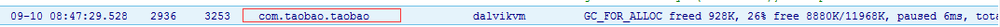
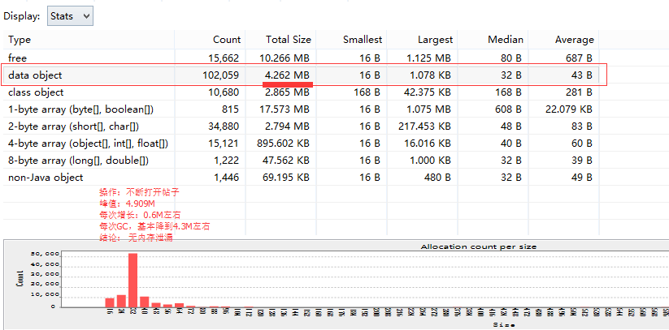
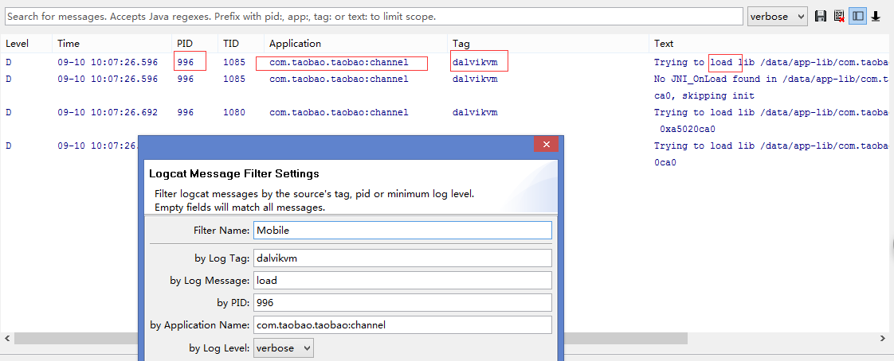

## adb1: install app on genymotion

## adb2: check package name

## adb3: using pull and push commands

## adb4: view local shared files or DB

## ddms1: check package name

## ddms2: view a scene of memory increase

## ddms3: add a filter to view log

## hierarchyviewer1: view structure diagram

## hierarchyviewer2: view the rendering performance of the control

